# 6.InnoDB 对 Buffer Pool 的奇思妙想

# 前言 

相信很多小伙伴在面试中都被问过「为什么要用缓存？」，大部分人都是回答：「减少数据库的磁盘`IO`压力」。

但是`MySQL`真的有如此不堪吗？

每次增删改查都要去走磁盘`IO`吗？

今天就聊聊`InnoDB`对`Buffer Pool`的奇思妙想。

# Buffer Pool

先梳理出问题，再思考如何解决问题。

假设我们就是`InnoDB`，我们要如何去解决磁盘`IO`问题？

这个简单，做缓存就好了，所以`MySQL`需要申请一块内存空间，这块内存空间称为`Buffer Pool`。

`Buffer Pool`是申请下来了，但是`Buffer Pool`里面放什么，要怎么规划？

## 缓存页

`MySQL`数据是以页为单位，每页默认`16KB`，称为数据页，在`Buffer Pool`里面会划分出若干**个缓存页**与数据页对应。

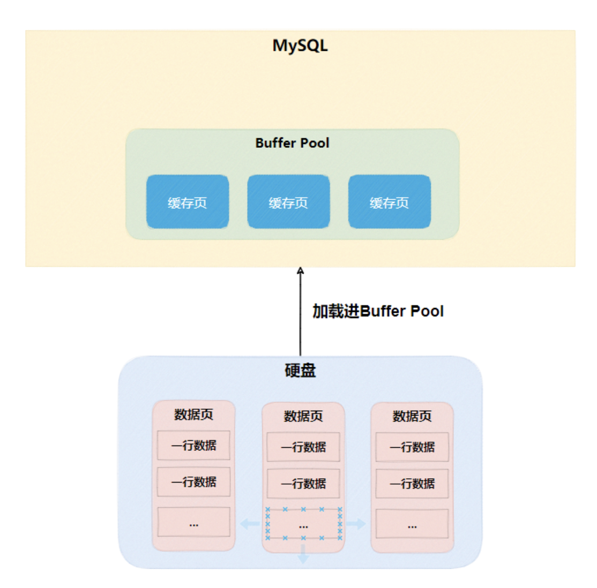

感觉还少了点什么，我们如何知道缓存页对应那个数据页呢？

## 描述数据

所有还需要缓存页的元数据信息，可以称为**描述数据**，它与缓存页一一对应，包含一些所属表空间、数据页的编号、`Buffer Pool`中的地址等等。

后续对数据的增删改查都是在`Buffer Pool`里操作

- 查询：从磁盘加载到缓存，后续直接查缓存
- 插入：直接写入缓存
- 更新删除：缓存中存在直接更新，不存在加载数据页到缓存更新

可能有小伙伴担心，`MySQL`宕机了，数据不就全丢了吗？

这个不用担心，因为`InnoDB`提供了`WAL`技术（Write-Ahead Logging），通过`redo log`让`MySQL`拥有了崩溃恢复能力。

再配合空闲时，会有异步线程做缓存页刷盘，保证数据的持久性与完整性。

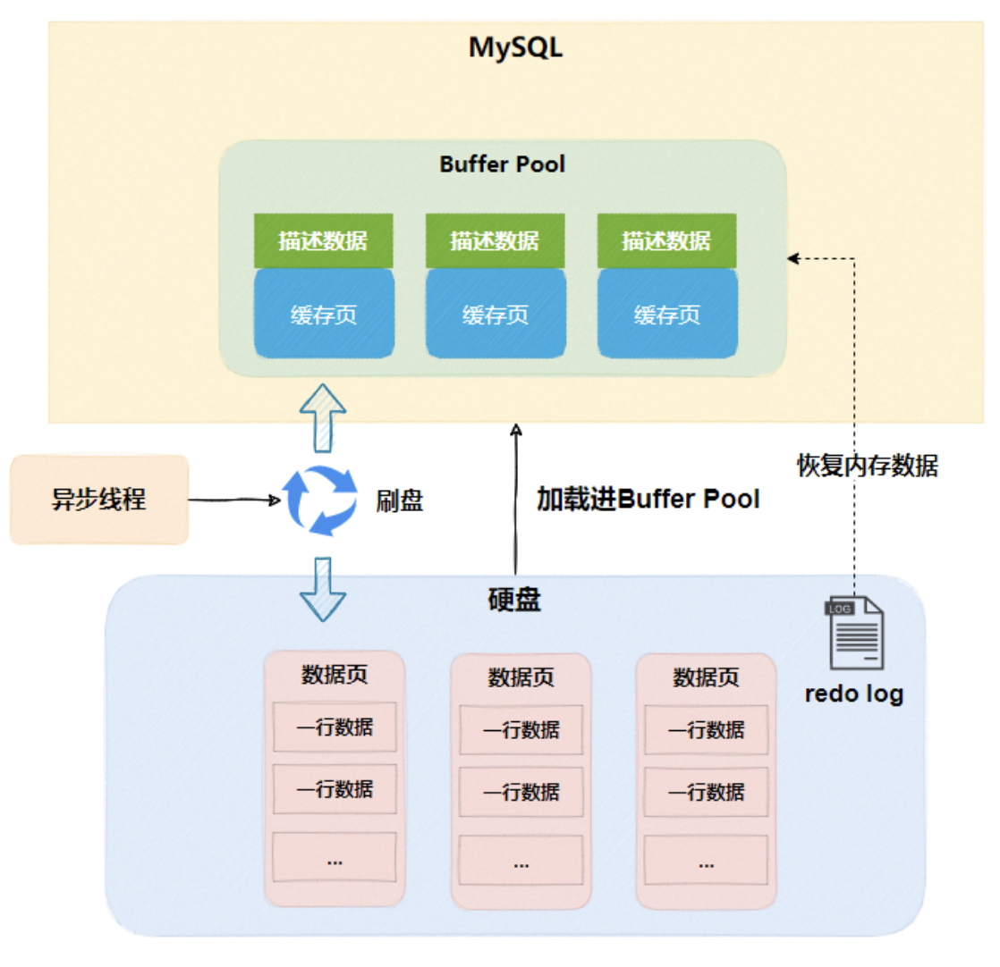

如果不能理解`redo log`是如何恢复数据的，可以看看阿星前面两篇文章

- [02.浅谈 MySQL InnoDB 的内存组件](https://mp.weixin.qq.com/s?__biz=MzAwMDg2OTAxNg==&mid=2652054485&idx=1&sn=cd6bead326dc5f5d8cf6af16893e9676&scene=21#wechat_redirect)
- [03.聊聊redo log是什么？](https://mp.weixin.qq.com/s?__biz=MzAwMDg2OTAxNg==&mid=2652054699&idx=1&sn=018017d9f3a61ca284970bbf65ea5138&scene=21#wechat_redirect)

另外，直接更新数据的缓存页称为**脏页**，缓存页刷盘后称为**干净页**

## Free链表

`MySQL`数据库启动时，按照设置的`Buffer Pool`大小，去找操作系统申请一块内存区域，作为`Buffer Pool`（**假设申请了512MB**）。

申请完毕后，会按照默认缓存页的`16KB`以及对应的`800Byte`的描述数据，在`Buffer Pool`中划分出来一个一个的缓存页和它们对应的描述数据。

`MySQL`运行起来后，会不停的执行增删改查，需要从磁盘读取一个一个的数据页放入`Buffer Pool`对应的缓存页里，把数据缓存起来，以后就可以在内存里执行增删改查。

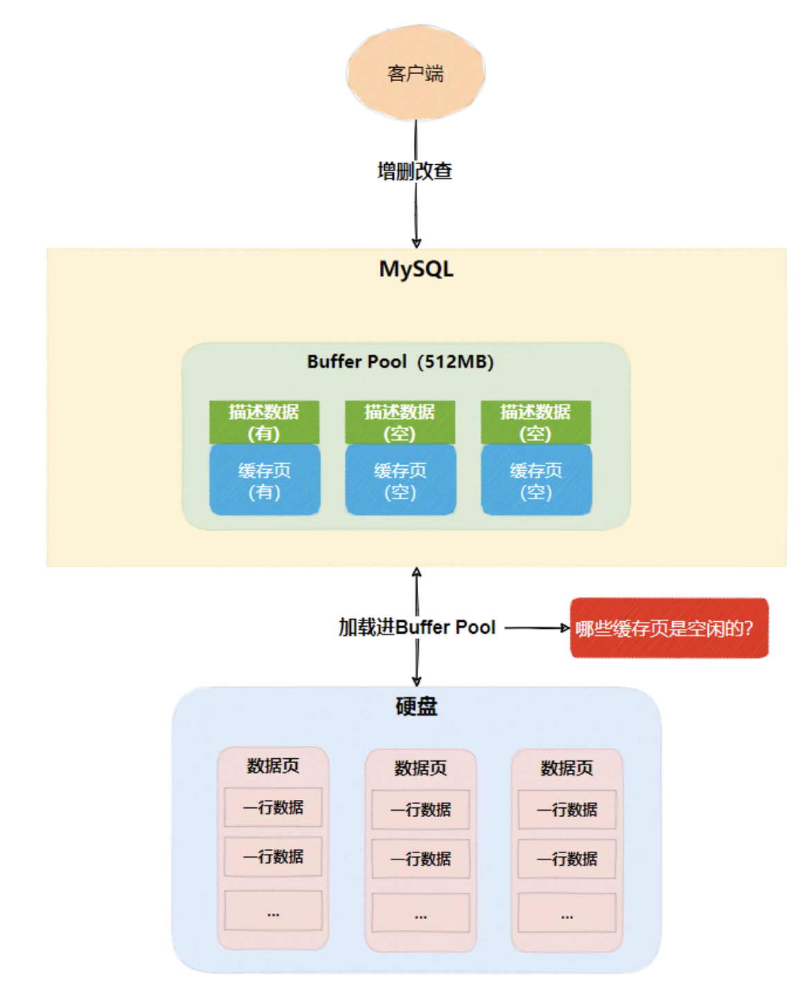

但是这个过程必然涉及一个问题，**哪些缓存页是空闲的**？

为了解决这个问题，我们使用链表结构，把空闲缓存页的**描述数据**放入链表中，这个链表称为`free`链表。

针对`free`链表我们要做如下设计

- 新增`free`基础节点
- 描述数据添加`free`节点指针

最终呈现出来的，是由空闲缓存页的**描述数据**组成的`free`链表。

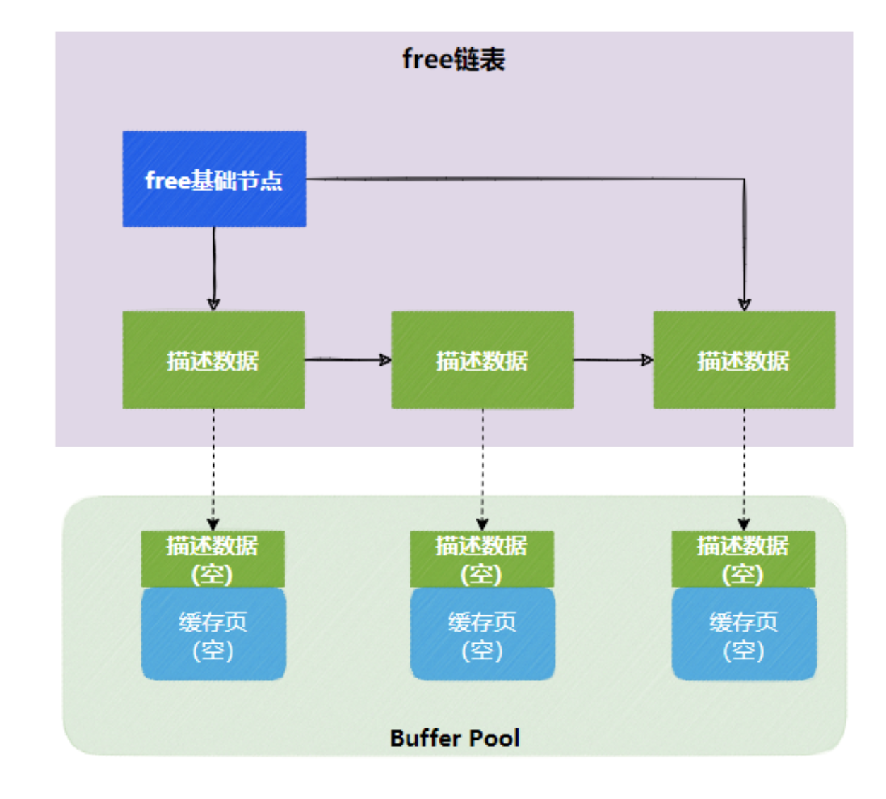

有了`free`链表之后，我们只需要从`free`链表获取一个**描述数据**，就可以获取到对应的缓存页。

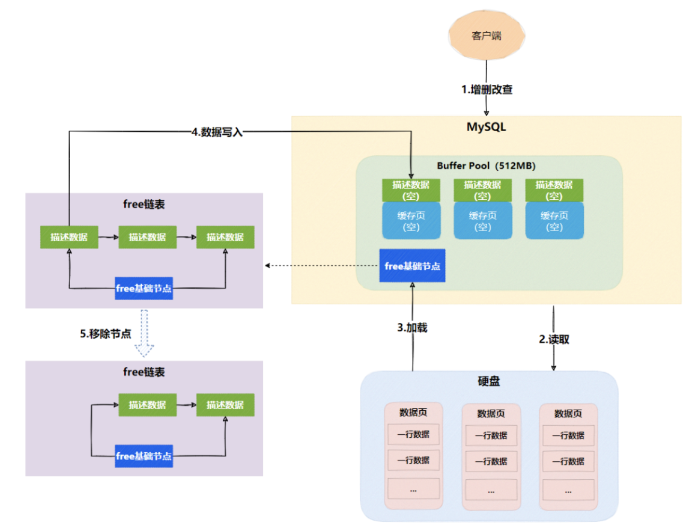

往**描述数据**与**缓存页**写入数据后，就将该**描述数据**移出`free`链表。

## 缓存页哈希表

数据页是缓存进去了，但是又一个问题来了。

下次查询数据时，如何在`Buffer Pool`里快速定位到对应的缓存页呢？

难道需要一个**非空闲的描述数据**链表，再通过**表空间号+数据页编号**遍历查找吗？

这样做也可以实现，但是效率不太高，时间复杂度是`O(N)`。

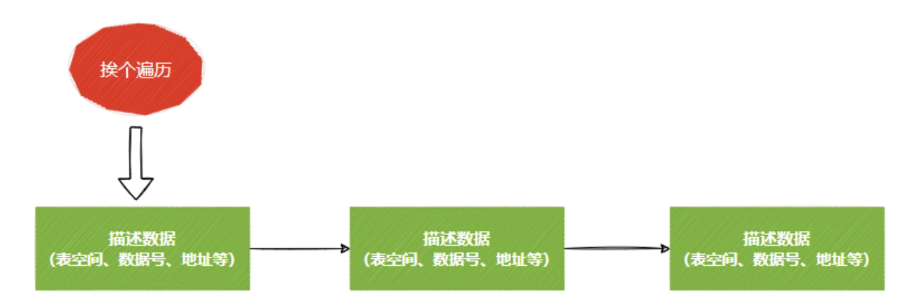

所以我们可以换一个结构，使用哈希表来缓存它们间的映射关系，时间复杂度是`O(1)`。

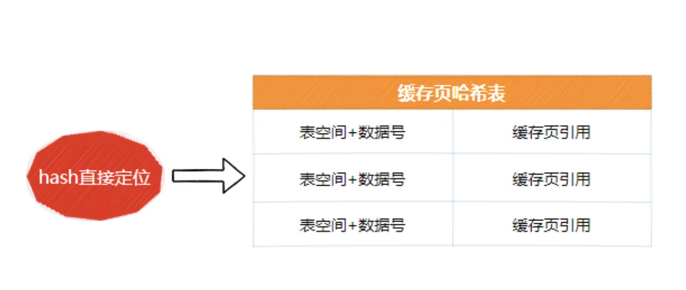

**表空间号+数据页号**，作为一个`key`，然后缓存页的地址作为`value`。

每次加载数据页到空闲缓存页时，就写入一条映射关系到**缓存页哈希表**中。

后续的查询，就可以通过**缓存页哈希表**路由定位了。

## Flush链表

还记得之前有说过「**空闲时会有异步线程做缓存页刷盘，保证数据的持久性与完整性**」吗？

新问题来了，难道每次把`Buffer Pool`里所有的缓存页都刷入磁盘吗？

当然不能这样做，磁盘`IO`开销太大了，应该把**脏页**刷入磁盘才对（更新过的缓存页）。

可是我们怎么知道，那些缓存页是**脏页**？

很简单，参照`free`链表，弄个`flush`链表出来就好了，只要缓存页被更新，就将它的**描述数据**加入`flush`链表。

针对`flush`链表我们要做如下设计

- 新增`flush`基础节点
- 描述数据添加`flush`节点指针

最终呈现出来的，是由更新过数据的缓存页**描述数据**组成的`flush`链表。

后续异步线程都从`flush`链表刷缓存页，当`Buffer Pool`内存不足时，也会优先刷`flush`链表里的缓存页。

## LRU链表

目前看来`Buffer Pool`的功能已经比较完善了。

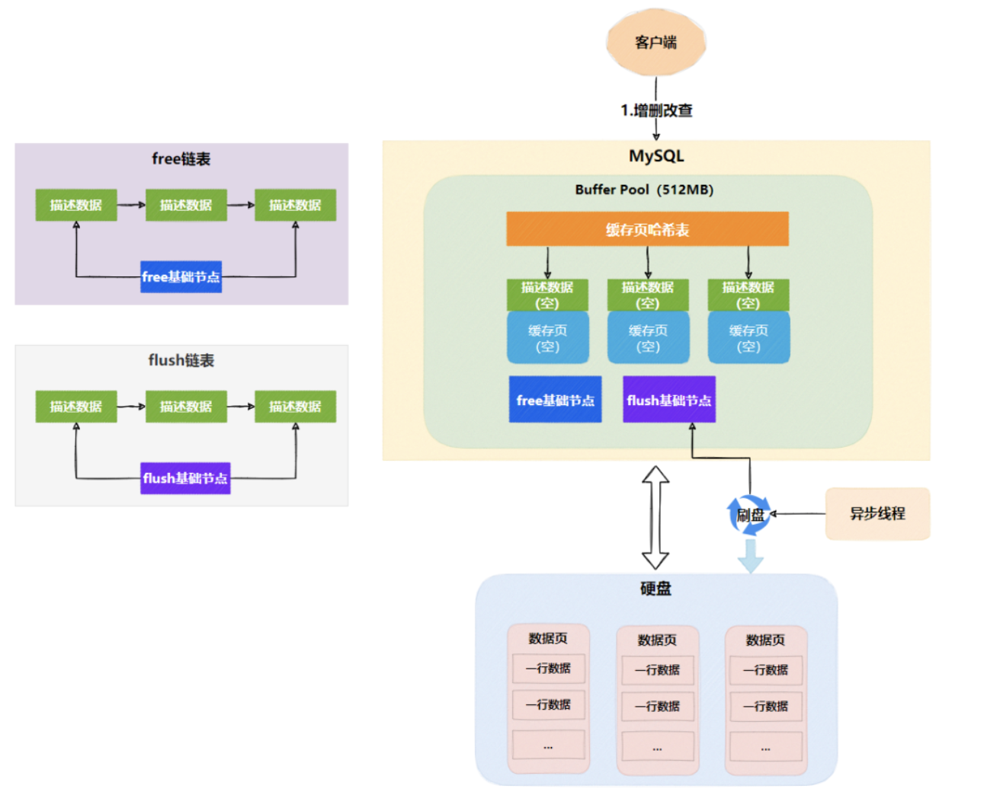

但是仔细思考下，发现还有一个问题没处理。

`MySQL`数据库随着系统的运行会不停的把磁盘上的数据页加载到空闲的缓存页里去，因此`free`链表中的空闲缓存页会越来越少，直到没有，最后磁盘的数据页无法加载。

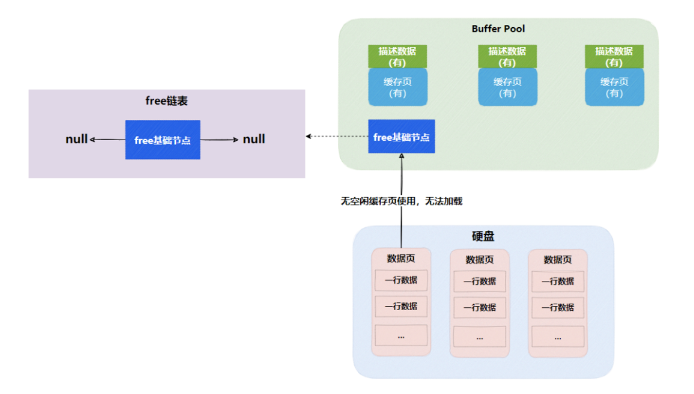

为了解决这个问题，我们需要淘汰缓存页，腾出空闲缓存页。

可是我们要优先淘汰那些缓存页？总不能一股脑直接全部淘汰吧？

这里就要借鉴`LRU`算法思想，把最少使用的缓存页淘汰（命中率低），提供`LRU`链表出来。

针对`LRU`链表我们要做如下设计

- 新增`LRU`基础节点
- 描述数据添加`LRU`节点指针

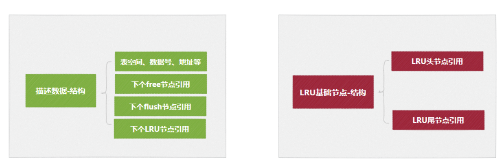

实现思路也很简单，只要是查询或修改过缓存页，就把该缓存页的描述数据放入链表头部，也就说近期访问的数据一定在链表头部。

当`free`链表为空的时候，直接淘汰`LRU`链表尾部缓存页即可。

## LRU链表优化

麻雀虽小五脏俱全，基本`Buffer Pool`里与缓存页相关的组件齐全了。

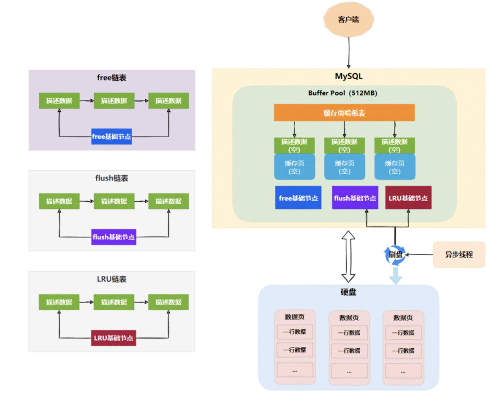

但是缓存页淘汰这里还有点问题，如果仅仅只是使用`LRU`链表的机制，有两个场景会让**热点数据**被淘汰。

- **预读机制**
- **全表扫描**

预读机制是指`MySQL`加载数据页时，可能会把它相邻的数据页一并加载进来（局部性原理）。

这样会带来一个问题，预读进来的数据页，其实我们没有访问，但是它却排在前面。

正常来说，淘汰缓存页时，应该把这个预读的淘汰，结果却把尾部的淘汰了，这是不合理的。

我们接着来看第二个场景全表扫描，如果**表数据量大**，大量的数据页会把空闲缓存页用完。

最终`LRU`链表前面都是全表扫描的数据，之前频繁访问的热点数据全部到队尾了，淘汰缓存页时就把**热点数据页**给淘汰了。

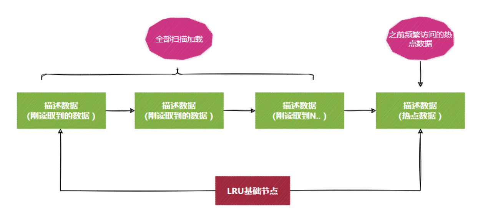

为了解决上述的问题。

我们需要给`LRU`链表做冷热数据分离设计，把`LRU`链表按一定比例，分为冷热区域，热区域称为`young`区域，冷区域称为`old`区域。

**以7:3为例，young区域70%，old`区域30%**

如上图所示，数据页第一次加载进缓存页的时候，是先放入冷数据区域的头部，如果1秒后再次访问缓存页，则会移动到热区域的头部。

这样就保证了**预读机制**与**全表扫描**加载的数据都在链表队尾。

`young`区域其实还可以做一个小优化，为了防止`young`区域节点频繁移动到表头。

`young`区域前面`1/4`被访问不会移动到链表头部，只有后面的`3/4`被访问了才会。

> 记住是按照某个比例将`LRU`链表分成两部分，不是某些节点固定是`young`区域的，某些节点固定是`old`区域的，随着程序的运行，某个节点所属的区域也可能发生变化。

# 小结

其实`MySQL`就是这样实现`Buffer Pool`缓存页的，只不过它里面的链表全**是双向链表**，阿星这里偷个懒，但是不影响理解思路。

读到这里，我相信大家对`Buffer Pool`缓存页有了深刻的认知，也知道从一个增删改查开始，如何缓存数据、定位缓存、缓存刷盘、缓存淘汰。

这里留问题给大家思考，`Free、Flush、LRU`这三个链表之间的联系，随着`MySQL`一直在运行，它们会产生怎样的联动。