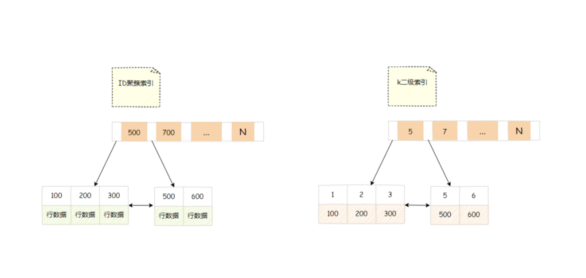
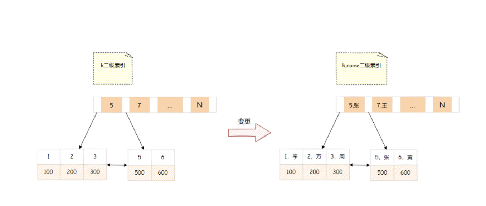
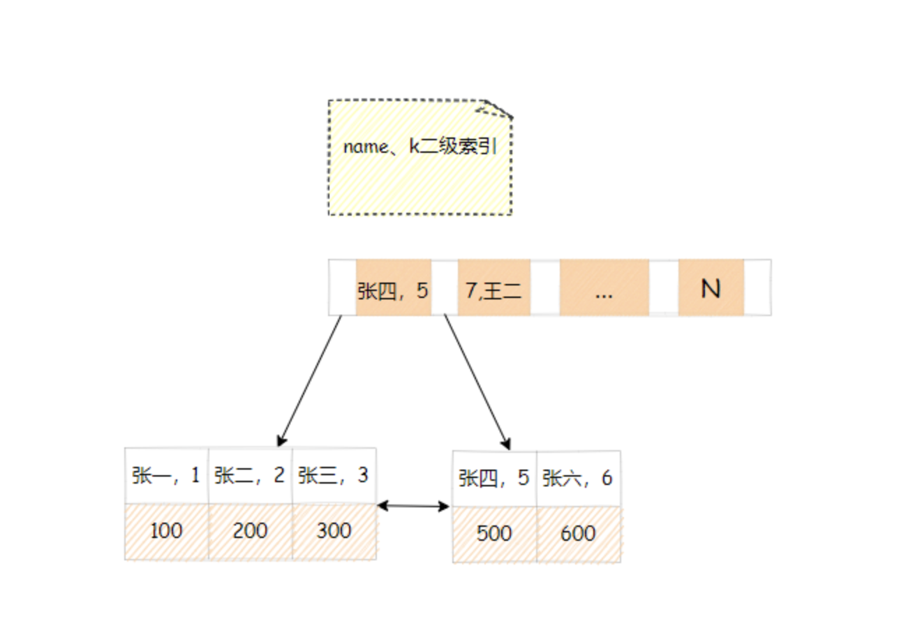

# InnoDB原理篇：如何用好索引

# 前言

**大家好，我是阿星。**

上一篇文章【[InnoDB原理篇：为什么使用索引会变快?](https://mp.weixin.qq.com/s?__biz=MzAwMDg2OTAxNg==&mid=2652055534&idx=1&sn=6bce05f55b7a290a16e71d3885bfbaf0&scene=21#wechat_redirect)】聊了下索引为什么快。

现在聊聊，我们如何用好索引

# InnoDB中索引分类

我们都知道`InnoDB`索引结构是`B+`树组织的，但是根据**数据存储形式不同**可以分为两类，分别是**聚簇索引**与**二级索引**。

ps：有些同学还听过**非聚簇索引**和**辅助索引**，其他它们都是一个意思，本文统一称为**二级索引**。

## 聚簇索引

**聚簇索引**默认是由**主键**构成，如果没有定义主键，`InnoDB`会选择非空的**唯一索引**代替，还是没有的话，`InnoDB`会**隐式**的定义一个主键来作为**聚簇索引**。

其实**聚簇索引**的本质就是**主键索引**。

因为每张表只能拥有一个**主键字段**，所以每张表只有一个**聚簇索引**。

另外**聚簇索引**还有一个特点，表的数据和主键是一起存储的，它的叶子节点存放的是整张表的行数据（树的最后一层），叶子节点又称为**数据页**。


很简单记住一句话：**找到了索引就找到了行数据，那么这个索引就是聚簇索引。**

如果这里无法理解的话，可以去补下阿星的前两篇文章

- [InnoDB原理篇：聊聊数据页变成索引这件事](https://mp.weixin.qq.com/s?__biz=MzAwMDg2OTAxNg==&mid=2652055534&idx=1&sn=6bce05f55b7a290a16e71d3885bfbaf0&scene=21#wechat_redirect)
- [InnoDB原理篇：为什么使用索引会变快?](https://mp.weixin.qq.com/s?__biz=MzAwMDg2OTAxNg==&mid=2652055534&idx=1&sn=6bce05f55b7a290a16e71d3885bfbaf0&scene=21#wechat_redirect)

## 二级索引

知道了**聚簇索引**，再来看看**二级索引**是什么，简单概括，**除主键索引以外的索引，都是二级索引**，像我们平时建立的联合索引、前缀索引、唯一索引等。

**二级索引**的叶子节点存储的是索引值+主键`id`。


所以二级索引与聚簇索引的区别在于**叶子节点是否存放整行记录**。

也就意味着，仅仅靠二级索引无法拿到完整行数据，只能拿到`id`信息。

那二级索引应该如何拿到完整行数据呢？

# 索引的查询

假设，我们有一个主键列为`id`的表，表中有字段`k`，`k`上有索引。这个表的建表语句是：

```
create table T(
id int primary key, 
k int not null, 
name varchar(16),
index (k))engine=InnoDB;
```

表中有`5`条记录`(id,k)`，值分别为`(100,1)、(200,2)、(300,3)、(500,5)、(600,6)`，此时会有两棵树，分别是主键`id`的**聚簇索引**和字段`k`的**二级索引**，简化的树结构图如下



## 回表

我们执行一条主键查询语句`select * from T where id = 100`，只需要搜索`id`聚簇索引树就能查询整行数据。


接着再执行一条`select * from T where k = 1`，此时要搜索`k`的二级索引树，具体过程如下

- **在 k 索引树上找 k = 1的记录，取得 id = 100**
- **再到聚簇索引树查 id = 100 对应的行数据**
- **回到 k 索引树取下一个值 k = 2，不满足条件，循环结束**


上图中，回到聚簇索引树搜索的过程，我们称为**回表**。

也就是说，基于**二级索引**的查询需要多扫描一棵**聚簇索引树**，因此在开发中尽量使用主键查询。

## 索引覆盖

可是有时候我们确实需要使用**二级索引查询**，有没有办法避免**回表**呢？

办法是有的，但需要结合业务场景来使用，比如本次查询只返回`id`值，查询语句可以这样写`select id from T where k = 1`，过程如下

- **在 k 索引树上找 k = 1的记录，取得 id = 100**
- **返回 id 值**
- **回到 k 索引树取下一个值 k = 2，不满足条件，循环结束**


在这个查询中，索引`k`已经**覆盖**了我们的查询需求，不需要回表，这个操作称为**覆盖索引**。

**由于覆盖索引可以减少树的搜索次数，显著提升查询性能，所以使用覆盖索引是一个常用的性能优化手段。**

假设现在有一个高频的业务场景，根据`k`查询，返回`name`，我们可以把`k`索引变更成`k`与`name`的联合索引。



这个联合索引就有意义了，它可以在高频场景用到**覆盖索引**，不再需要**回表**查整行记录，减少语句的执行时间。

ps：**设计索引时，请遵守最左原则匹配**

## 索引下推

此时我们再建立一个`name`与`k`的联合索引。



执行`select k from T where name like '张%' and k = 2`语句。

首先会在`name`与`k`树中用**张**找到第一条件满足条件的记录`id = 100`，然后从`id = 100`开始遍历一个个**回表**，到**主键索引**上找出行记录，再对比`k`字段值，是不是十分操蛋。

可以看到总共**回表**了`6`次

不过在`MySQL 5.6`版本引入的**索引下推**，可以在索引遍历过程中，对索引中包含的字段先做判断，直接过滤掉不满足条件的记录，减少**回表**次数。


总共回表`0`次。

# 小结

本篇文章到这里就结束了，今天和大家聊了聚簇索引、二级索引、回表、覆盖索引、索引下推等知识，可以看到，在满足语句需求的情况下，尽量少地访问资源是数据库设计的重要原则之一，由于篇幅有限，很多内容还没展开，后续阿星会和大家聊聊如何设计索引。